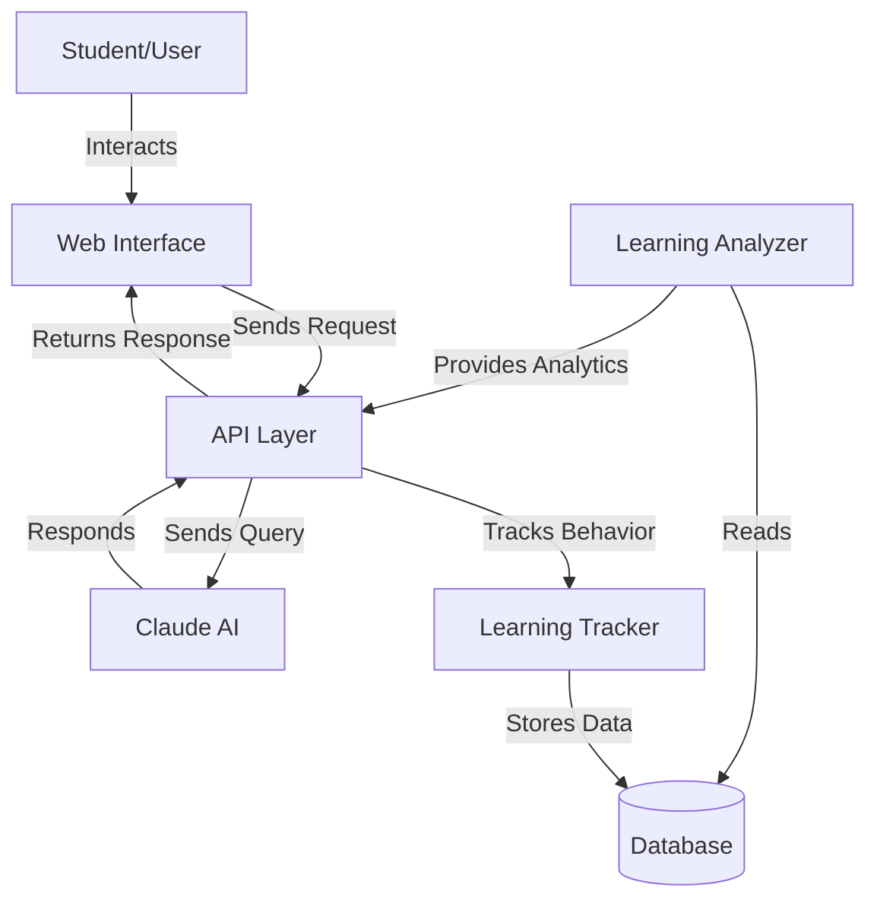
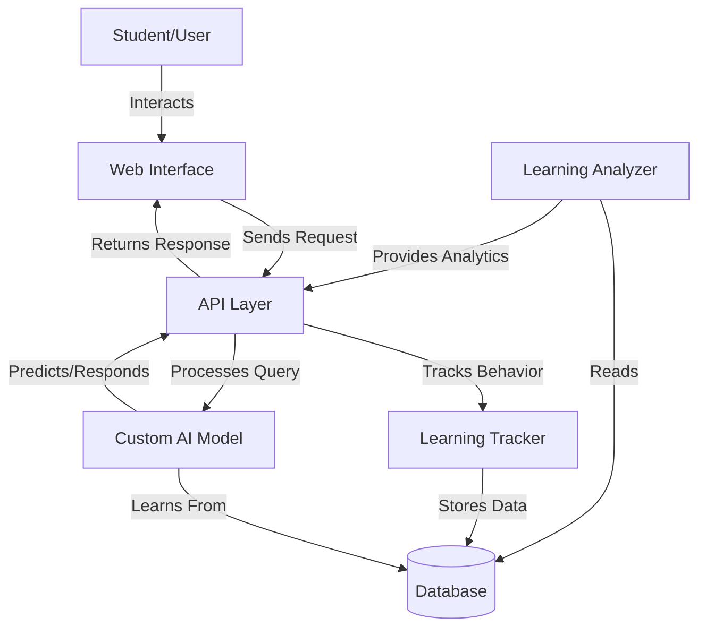
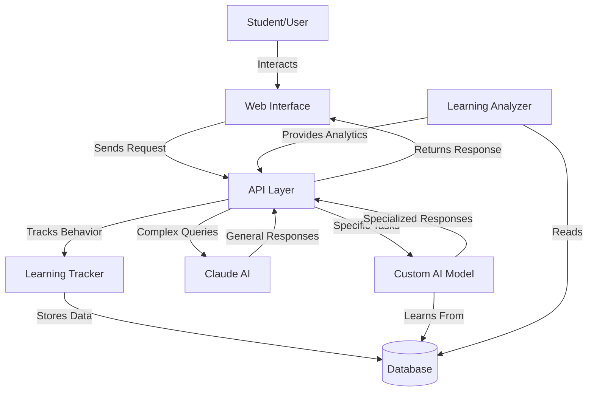

# AI System Architecture Options

## Option 1: Claude Integration

## Option 2: Custom AI System

## Option 3: Hybrid System

## Components Explanation

### Common Components
- **User Interface**: Web interface where students interact
- **API Layer**: Handles all requests and routes them appropriately
- **Learning Tracker**: Records student behavior and interactions
- **Database**: Stores all learning data and interactions
- **Learning Analyzer**: Analyzes learning patterns and progress

### Claude-Specific
- **Claude AI**: Handles natural language processing and responses
- Benefits from existing powerful language model
- No training required

### Custom AI-Specific
- **Custom AI Model**: Specialized for specific learning tasks
- Can be trained on your specific data
- More control over responses

### Hybrid-Specific
- Combines both Claude and Custom AI
- Uses each for their strengths
- More complex but more flexible
