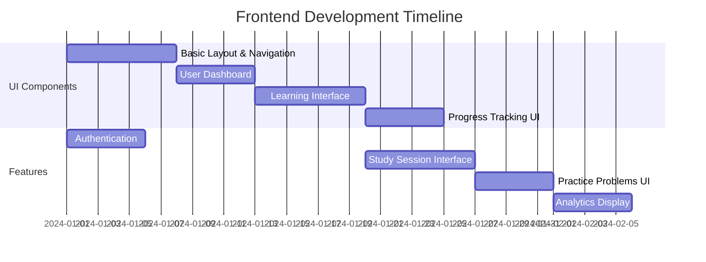
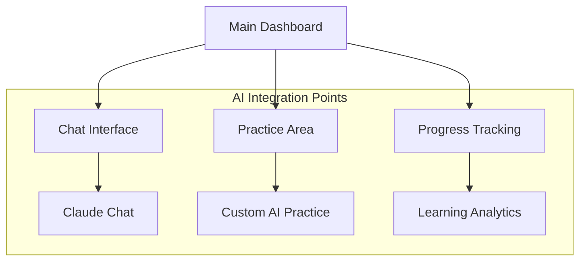

# Development Roadmap

## Phase 1: Frontend Development 🎨

## Phase 2: AI Integration Planning 🧠

### Claude Integration
1. **API Setup**
   - Get Anthropic API key
   - Set up API endpoints
   - Create conversation handlers

2. **Features to Build**
   - Chat interface for questions
   - Response formatting
   - Context management
   - Error handling

### Custom AI Components
1. **Learning Analysis**
   - Student performance tracking
   - Pattern recognition
   - Progress prediction
   - Difficulty adjustment

2. **Practice Generation**
   - Question generation
   - Answer validation
   - Hint system
   - Performance scoring

## Phase 3: Integration Points 🔄

### Frontend Components Needed:

### API Endpoints to Prepare:
1. `/api/chat` - Claude conversations
2. `/api/practice` - Custom exercises
3. `/api/analytics` - Learning analysis
4. `/api/progress` - Track progress
5. `/api/recommendations` - Get recommendations

## Implementation Order:

1. **Frontend First**
   - Complete UI components
   - Add placeholder data
   - Set up routing
   - Style components

2. **Basic Backend**
   - Set up endpoints
   - Basic data storage
   - User management
   - Session tracking

3. **AI Integration**
   - Claude API setup
   - Custom AI basic features
   - Learning analytics
   - Testing & refinement

## Next Steps 👣

1. **Start Frontend Development**
   - [ ] Set up project structure
   - [ ] Create component library
   - [ ] Build main interfaces
   - [ ] Add user flows

2. **Prepare for AI (While Building Frontend)**
   - [ ] Get Claude API key
   - [ ] Plan data structures
   - [ ] Design AI interfaces
   - [ ] Create test datasets

3. **Future AI Features**
   - [ ] Real-time learning assistance
   - [ ] Personalized recommendations
   - [ ] Adaptive difficulty
   - [ ] Progress predictions

## Notes 📝

- Frontend can work with mock data initially
- AI features can be added incrementally
- Start with basic Claude integration
- Add custom AI features gradually
- Test each component separately
