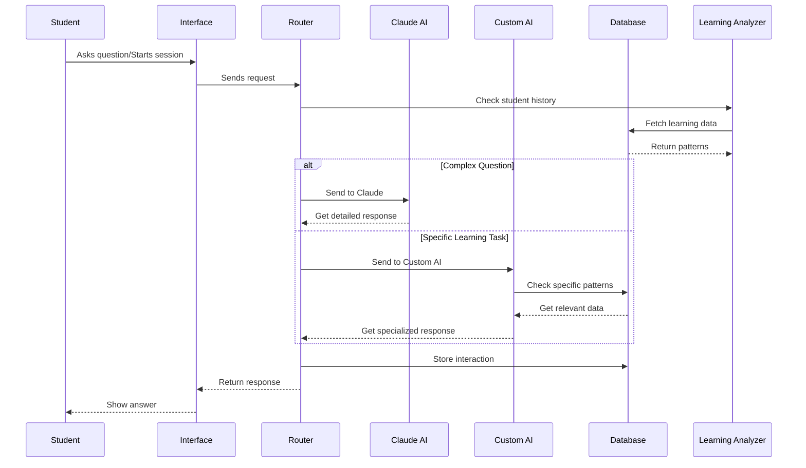
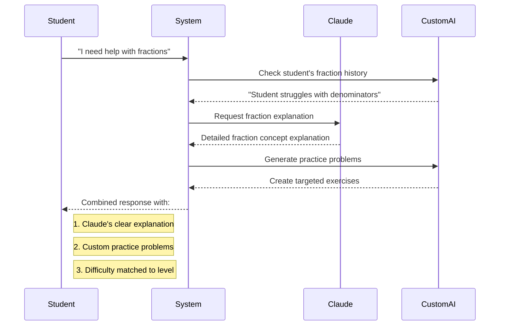

# Hybrid AI System Detailed Explanation

## System Flow


## Example Interaction

```mermaid
graph TD
    subgraph Student Input
    A[Student asks: "Help me with math"]
    end

    subgraph System Processing
    B[Router analyzes request]
    C[Learning Analyzer checks history]
    D{Decision maker}
    end

    subgraph Claude AI
    E1[Handles complex explanations]
    E2[General math concepts]
    E3[Natural dialogue]
    end

    subgraph Custom AI
    F1[Personalized exercises]
    F2[Progress tracking]
    F3[Difficulty adjustment]
    end

    A --> B
    B --> C
    C --> D
    D --> |Complex questions| E1
    D --> |Specific practice| F1
    E1 --> G[Combined Response]
    F1 --> G
    G --> H[Student Interface]
```

## How It Works

1. **Input Processing**
   - Student asks a question or starts a learning session
   - System analyzes the request type
   - Checks student's learning history

2. **Decision Making**
   - Complex questions → Claude AI
   - Specific exercises → Custom AI
   - Learning analytics → Both

3. **Claude AI Handles**
   - Detailed explanations
   - Complex problem-solving
   - Natural conversations
   - General knowledge

4. **Custom AI Handles**
   - Personalized practice problems
   - Progress tracking
   - Difficulty adjustments
   - Specific subject mastery

5. **Combined Benefits**
   - Better personalization
   - More accurate progress tracking
   - Powerful explanations
   - Targeted practice

## Real Example


